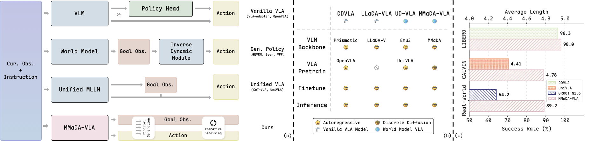

# 🤖 MMaDA-VLA: Large Diffusion Vision-Language-Action Model with Unified Multi-Modal Instruction and Generation

<div align="center">

[Yang Liu](https://yliu-cs.github.io) · [Pengxiang Ding](https://dingpx.github.io) · Tengyue Jiang · Xudong Wang · [Minghui Lin](https://scholar.google.com/citations?user=7lT8oQsAAAAJ) · [Wenxuan Song](https://songwxuan.github.io) · [Hongyin Zhang](https://scholar.google.com/citations?user=PXrMYi8AAAAJ) · [Zifeng Zhuang](https://scholar.google.com/citations?user=-KANvNMAAAAJ) · [Han Zhao](https://h-zhao1997.github.io) · Wei Zhao · [Siteng Huang](https://kyonhuang.top) · Jinkui Shi · [Donglin Wang](https://milab.westlake.edu.cn)

[](https://yliu-cs.github.io/MMaDA-VLA)
[](https://arxiv.org/abs/2603.25406)
[](LICENSE)
[](https://www.python.org/)
[](https://pytorch.org/)

</div>

<p align="center">
  
</p>

---

## 🏠 Installation

### Quick Setup

```bash
# Clone the repository
git clone https://github.com/yliu-cs/MMaDA-VLA.git
cd MMaDA-VLA

# Create conda environment
conda create -n mmada-vla python=3.11 -y
conda activate mmada-vla

# Install dependencies
pip install -r requirements.txt
```

---

## 📊 Data Preparation

### Download Datasets

Please download [Open-X Embodiment](https://huggingface.co/collections/IPEC-COMMUNITY/openx-lerobot-67c29b2ee5911f17dbea635e), [CALVIN](https://github.com/mees/calvin/tree/main/dataset), [LIBERO](https://huggingface.co/datasets/yifengzhu-hf/LIBERO-datasets) datasets before preprocessing.
<!-- [SSV2](https://www.qualcomm.com/developer/software/something-something-v-2-dataset) -->

### Preprocessing

```bash
# Step 1: Extract all actions
python mmadavla/data/preprocess.py --action_flag --num_chunks 1

# Step 2: Normalize actions
python mmadavla/data/preprocess.py --norm_action

# Step 3: Preprocess datasets (run in parallel)
for i in 0 8 16; do
    bash scripts/data/preprocess.sh $i
done

# Step 4: Merge dataset files
python mmadavla/data/preprocess.py --merge
```

---

## 🚀 Training

### Pre-training

Train MMaDA-VLA from scratch on large-scale robotics data:

```bash
accelerate launch \
    --config_file './scripts/ds/8_node_8_gpus_deepspeed_zero2.yaml' \
    mmadavla/train/train_mmadavla.py \
    --action_chunk_size 5 \
    --num_train_epochs 1 \
    --data_paths /path/to/preprocessed/data
```

### Fine-tuning

Download our pre-trained MMaDA-VLA checkpoint from [🤗 Hugging Face](https://huggingface.co) (coming soon).

#### CALVIN Benchmark

```bash
accelerate launch \
    --config_file './scripts/ds/1_node_8_gpus_deepspeed_zero2.yaml' \
    mmadavla/train/train_mmadavla.py \
    --pretrained_mmadavla /path/to/pretrained/mmada-vla \
    --action_chunk_size 10 \
    --num_train_epochs 2 \
    --data_paths /path/to/preprocessed/10chunk/calvin
```

#### LIBERO Benchmark

```bash
accelerate launch \
    --config_file './scripts/ds/1_node_8_gpus_deepspeed_zero2.yaml' \
    mmadavla/train/train_mmadavla.py \
    --pretrained_mmadavla /path/to/pretrained/mmada-vla \
    --action_chunk_size 5 \
    --num_train_epochs <epochs> \
    --data_paths /path/to/preprocessed/10chunk/libero/suite
```

---

## 🏆 Evaluation

```bash
# Benchmark Preparation
git clone https://github.com/yliu-cs/LIBERO
pip install -e LIBERO
pip install imageio[ffmpeg] robosuite==1.4.1 bddl easydict cloudpickle gym

git clone --recurse-submodules https://github.com/yliu-cs/calvin.git
cd calvin
bash install.sh

# Launch evaluation server
python mmadavla/eval/flask/server.py \
    --mmadavla_path /path/to/finetuned/mmada-vla \
    --port port
```

---

## ❤️ Acknowledgment

We sincerely thank [LLaDA](https://github.com/ML-GSAI/LLaDA), [Show-o](https://github.com/showlab/Show-o), [MMaDA](https://github.com/Gen-Verse/MMaDA), [dLLM-cache](https://github.com/maomaocun/dLLM-cache), [LLaVA-VLA](https://github.com/OpenHelix-Team/LLaVA-VLA), [openpi](https://github.com/Physical-Intelligence/openpi), [VLA-Adapter](https://github.com/OpenHelix-Team/VLA-Adapter) and [dLLM-RL](https://github.com/Gen-Verse/dLLM-RL) for their excellent code implementations.

---

## 📜 Citation

If you find MMaDA-VLA useful for your research, please consider citing our paper:

```bibtex
@article{liu2026mmadavla,
  author    = {Yang Liu and Pengxiang Ding and Tengyue Jiang and Xudong Wang and Minghui Lin and Wenxuan Song and Hongyin Zhang and Zifeng Zhuang and Han Zhao and Wei Zhao and Siteng Huang and Jinkui Shi and Donglin Wang},
  title     = {{MMaDA-VLA}: Large Diffusion Vision-Language-Action Model with Multimodal Instruction and Generation},
  journal   = {CoRR},
  volume    = {abs/2603.25406},
  year      = {2026},
  url       = {https://arxiv.org/abs/2603.25406}
}
```

---

<div align="center">

**⭐ Star us on GitHub if you find this project helpful!**

</div>
